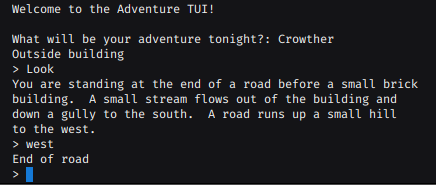

<div align = "center">

<h1><a href="https://2kabhishek.github.io/adventure-tui">adventure-tui</a></h1>

<a href="https://github.com/2KAbhishek/adventure-tui/blob/main/LICENSE">
 </a>

<a href="https://github.com/2KAbhishek/adventure-tui/pulse">
 </a>

<a href="https://github.com/2KAbhishek/adventure-tui/stargazers">
</a>

<a href="https://github.com/2KAbhishek/adventure-tui/network/members">
 </a>

<a href="https://github.com/2KAbhishek/adventure-tui/watchers">
 </a>

<a href="https://github.com/2KAbhishek/adventure-tui/graphs/contributors">
 </a>

<a href="https://github.com/2KAbhishek?tab=followers">
 </a>

<h3>Adventuring from the Terminal! ⚔🗺️</h3>

<figure>
  
  <br/>
  <figcaption>adventure-tui screenshot</figcaption>
</figure>

</div>

## What is this

Adventure TUI is a text adventure game, where you can explore different world right from you terminal.

You can add your own adventures too, see below to learn how.

## Inspiration

I have spent so many nights on text-based adventure games, this is my tribute to Will Crowther's original "Adventure" from early 1970s.

## Prerequisites

Before you begin, ensure you have met the following requirements:

- You have installed the latest version of `java`

## Getting adventure-tui

To get adventure-tui, follow these steps:

```bash
git clone https://github.com/2kabhishek/adventure-tui
cd adventure-tui
```

## Using adventure-tui

After cloning you can use VS Code (with Java extentsions), or any other editor/IDE to run this.

For running it from the command line, follow these steps

```
cd src/
# Compile Adventure.java
javac Adventure.java
# Run Adventure.java
java Adventure
```

Once you run the game you will be asked to choose an adventure, You can choose between `Crowther`, `Small` or a custom adventure you added.

If you see errors while running from the Terminal, you can edit the `DATA_PATH` variable in `src/Adventure.java`

## Adding new Adventures

You can add your own adventures by adding `<AdventureName>Rooms.txt`, `<AdventureName>Objects.txt` and `<AdventureName>Synonyms.txt` to the `data` folder.

The Rooms, Objects and Synonyms follow a particular syntax, follow these to add your own adventures!

> Everything after # is a comment, note that the data files themselves do not support comments

### Adding Rooms

Rooms data file contains information about all the rooms or areas part of your adventure game.

It also contains something called a motion table that defines the different rooms you can go from there.

#### Structure of a Rooms

```text
1 # Room number
Outside building # Room name
This is outside a building. # Room description
There are gates on all four sides # Can be multi line too
----- # Room description and motion table separator
WEST    2 # Direction    Destination Room Number
EAST    3 # DIRECTION should be in caps
NORTH   4/KEYS # If any room has / and <ObjectName> appended to it, that means this room is locked and you need to have the <ObjectName> in your inventory in order to proceed
 # Mandatory empty line
2 # New Room starts
Dark Abyss
A dark abyss
-----
FORCED    0 # If direction is forced, the game will forcefully take you to the destination room
```

#### Example Room Data

```text
1
Outside building
You are standing at the end of a road before a small brick
building.  A small stream flows out of the building and
down a gully to the south.  A road runs up a small hill
to the west.
-----
WEST       2
UP         2
NORTH      3
IN         3
SOUTH      4
DOWN       4

2
End of road
You are at the end of a road at the top of a small hill.
You can see a small building in the valley to the east.
-----
EAST       1
DOWN       1
```

### Adding Objects

Objects data file contains info about all the objects in the game and their initial location.

#### Structure of Objects

```text
KEYS # Object Name
Shining metal keys # Object description
3 # Initial room location
# Empty line
LAMP
A bright lamp
8
```

#### Example Objects Data

```text
KEYS
a set of keys
3

LAMP
a brightly shining brass lamp
8

ROD
a black rod with a rusty star
12
```

### Adding Synonyms

Synonyms data file is used for creating mappings or shortcuts for Actions/Directons/Objects in the game.

So something like `BAG OF GOLD COINS` can be called `COINS` or `GOLD`

#### Structure of Synonyms

```text
GOLD=BAG OF COLD COINS
COINS=BAG OF GOLD COINS
IN=INSIDE
Q=QUIT
```

## How it was built

adventure-tui was built using `java` and lots of imagination!

## Challenges faced

- Building out the Abstractions was challenging
- Breaking the problem into smaller pieces was daunting in the begining

## What I learned

While building adventure-tui I learned about

- How to build abstractions using OOP
- Efficient use of txt files for data storage
- Building Text adventure games is fun!

## What's next

Maybe add a new game, just have to add a new rooms and objects file!

Hit the ⭐ button if you found this useful.

## More Info

<div align="center">

<a href="https://github.com/2KAbhishek/adventure-tui">Source</a> | <a href="https://2kabhishek.github.io/adventure-tui">Website</a>

</div>
